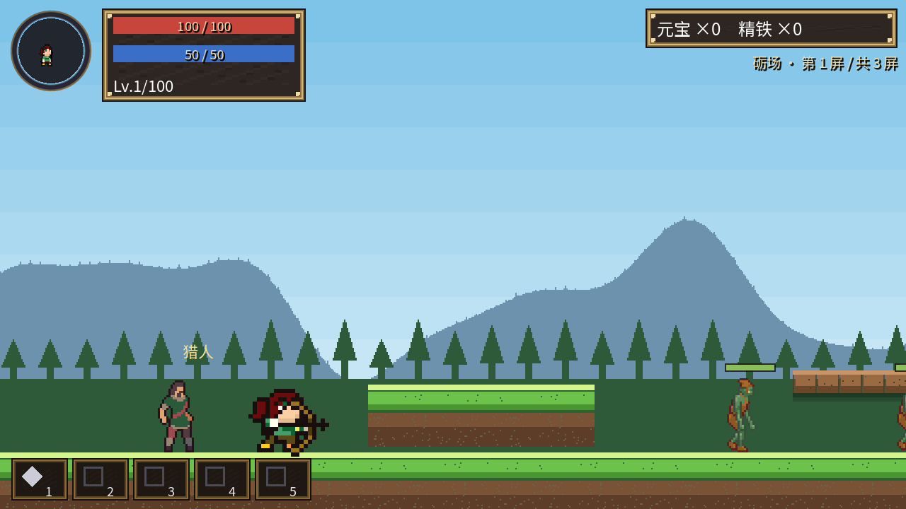

# 百炼

**横版动作闯关**。城镇整备 → 闯关打怪 → 打 Boss → 掉装备 → 打造强化 → 变强 → 推进主线。

---

## 现在就玩

### 网页版 · 点开即玩，不用安装

👉 **https://718b0657ebd24f07886bb062e2c4256e.app.workbuddy.host**

- **首次加载要 10~30 秒**（约 40MB 的游戏引擎在下载），之后就快了
- **进去后先点一下画面** —— 浏览器规定「点击之后」才把键盘交给游戏
- 线上是 2026-09-16 的 v0.1 构建，**可能落后于本仓库的最新代码**
- 存档存在**浏览器本地**，换浏览器 / 清缓存会丢

### Windows 版

单文件 exe（解压即玩）**待发布**。想自己跑源码：用 **Godot 4.7.x** 打开本目录下的 `project.godot`，按 `F5`。

---

## 操作

| 动作 | 按键 |
|---|---|
| 移动 | `A` `D` 或 `←` `→` |
| 跳跃 | `Space` / `W` / `↑` |
| **攻击**（连点三下 = 三段连招） | `J` |
| **交谈 / 阅读告示牌 / 确认** | `J` |
| 闪避 | `K` |
| 放技能 | `1` ~ `5`（`L` 等同 1 号格） |
| 角色面板 | `C` |
| 装备背包 | `B` |
| 技能面板 | `V` |
| **打开舆图**（站在舆图台旁） | `P` |
| 暂停菜单 | `Esc` |

倒下之后：`↑↓` 选「重新开始 / 返回城镇」，`J` 确认。

> **第一次玩**：进城镇先往右走两步，有一块木牌 —— **走近按 `J`**，上面写的正是上面这些。

---

## 这一版有什么

### 两个可玩角色（在「新的开始」里选）

| | |
|---|---|
|  | **剑客 · 铁衣** —— 贴身三段斩 **弓手 · 逐风** —— 远程三段连射 |

### 两张地图 · 六个副本

| 地图 | 副本（顺序即解锁顺序） |
|---|---|
| **淬火岭** | 砺场（3 屏） → 断淬渠（4 屏） → 炉喉（5 屏） |
| **剑冢** | 残剑林（3 屏） → 锈蚀甬道（4 屏） → 冢心（5 屏） |

进一次副本就是**一条多屏的长路**：一屏的怪分三批陆续出来，**打完一批才出下一批**，
全清空了才走得过去（**挡墙是看不见的**，撞上去会给一句提示）。最后一屏打 Boss，
**打完整个副本才回舆图**。

### 其他

- **8 种小怪**（含精英变体）+ **6 个 Boss**
- 打怪**掉装备**（四个部位、带词条与图标），也掉**元宝**与**药**（药掉地上**走近直接喝**）
- **铁匠铺**逐件强化（按品质封顶）、**商店**买卖（背包里按 `K` 出售）
- 对话与主线；**等级上限 100**（升级是解锁内容的钥匙，不是战力轴）
- **7 个技能**，能带 5 个
- 有音效；有设置（音乐 / 音效 / 语言，**可切英文**）

---

## 已知问题（测试版）

- **只有前两章** —— 冢心之后暂时没有内容了
- **数值没平衡过** —— 后半程难度可能偏陡或偏软
- **弓手没有受击动画**：挨打时有闪红反馈，但不做动作（素材包里就没有这一组帧）
- 网页版**存档在浏览器里**，换设备不通用
- 打击感（屏震 / 顿帧 / 粒子）还在调

---

## 存档

**15 个存档槽**（菜单里 5 个一页，翻 3 页）。写档时机是暂停菜单里的「保存游戏」和回主菜单；
「新的开始」点到有档的槽会**先弹覆盖确认**，手滑抹不掉旧档。

旧版本的档**不会作废** —— 等级 / 装备 / 精铁照旧带回，但「打到第几关」会重来，
存档列表上会标出来。

---

## 授权与素材

游戏代码以 **Apache License 2.0** 发布（见 `LICENSE`）。

画面里的像素素材来自这些创作者 —— **请不要单独取用本仓库内的素材图**，各自许可如下：

| 素材 | 作者 | 许可 |
|---|---|---|
| 主角 · 剑客 | Mattz Art | 自定义：可商用，**禁止把素材本身转售或再分发** |
| 小怪与 Boss | MoikMellah | CC0 1.0 |
| NPC（老铁匠 / 猎人） | CraftPix.net | OGA-BY 3.0 |
| 主角 · 弓手 | DezrasDragons | CC0 1.0 |
| 界面面板 | Kenney | CC0 1.0 |
| 中文字体 | Google Noto Sans SC | SIL OFL 1.1 |

完整来源链接、各包许可原文、以及本项目原创（程序化生成）的素材清单，
见 [`assets/CREDITS.md`](assets/CREDITS.md)。
